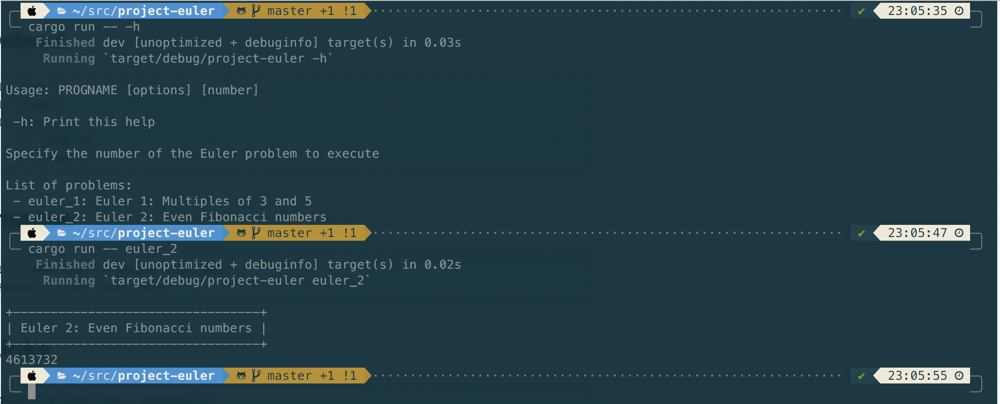
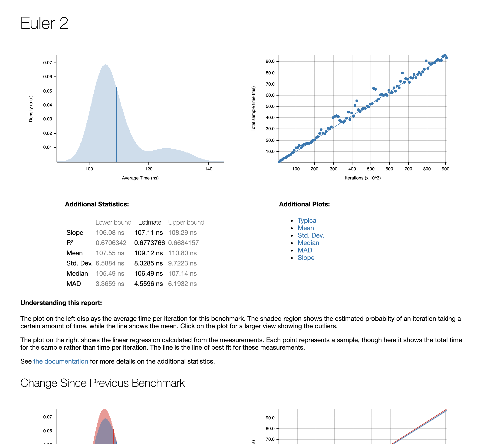

# Project Euler problems

See https://projecteuler.net/

## Installation

Rust and Cargo toolchain needed.

## Usage

List all solved problems:

```bash
cargo run -- -h
```

Solve Euler 2:

```bash
cargo run -- euler_2
```



## Benchmarking solutions

In order to benchmark solutions I added support for the excellent **Criterion** module.

Use `cargo bench` to run all benchmarks.

Criterion uses statistical analysis and compares each run to the previous one
in order to detect improvement or regression. Graphs are generated
in `target/criterion`.

Use `open target/criterion/report/index.html` to show all statistics:



## Authors

* [Project Euler](https://projecteuler.net//) for the problems
* Farzad FARID <[farzy@farzy.org](mailto:farzy@farzy.org)>

## License

All code is published under the Apache 2.0 License.
